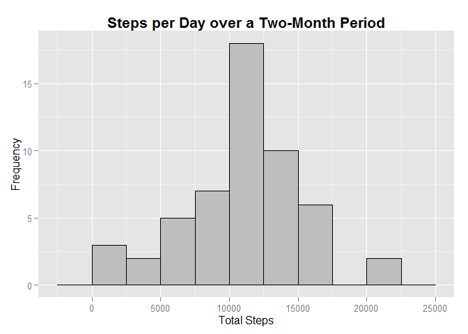
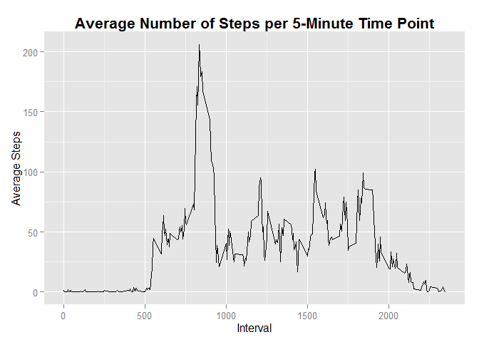
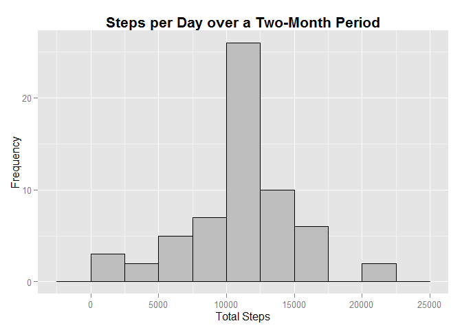
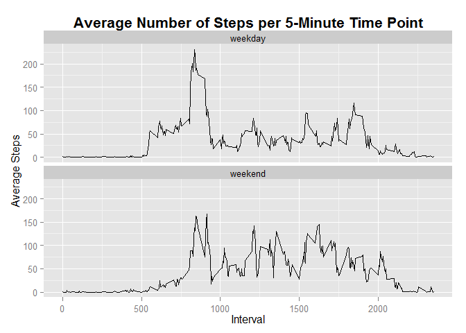

# Reproducible Research: Peer Assessment 1

The data set used for this assignment contains the number of steps of an anonymous individual, collected through a personal activity monitoring device in 5-minute itervals every day for two months. All analysis was done using R-3.1.1.  


Load the data  
------------  
The first step is to load required packages and to load the data in R.


```r
library(dplyr)
library(ggplot2)
library(knitr)

activity <- read.csv("activity.csv")
```


What is the mean total number of steps taken per day?  
------------  
For this part of the assignment, missing values can be ignored.

##### 1. Calculate the total number of steps taken per day


```r
act_by_date <- activity %>%
      na.omit() %>%
      group_by(date) %>%
      summarize(steps = sum(steps))

head(act_by_date, n = 5)
```

```
## Source: local data frame [5 x 2]
## 
##         date steps
## 1 2012-10-02   126
## 2 2012-10-03 11352
## 3 2012-10-04 12116
## 4 2012-10-05 13294
## 5 2012-10-06 15420
```

##### 2. Make a histogram of the total number of steps taken each day


```r
ggplot(data = act_by_date, aes(steps)) + 
      geom_histogram(binwidth = 2500, color = "black", fill = "gray") +
      ggtitle("Steps per Day over a Two-Month Period") +
      labs(x = "Total Steps", y = "Frequency") +
      theme(plot.title = element_text(size = 16, face = "bold"))
```

 

##### 3. Calculate and report the mean and median of the total number of steps taken per day


```r
steps_mean <- mean(act_by_date$steps)
steps_median <- median(act_by_date$steps)
```

The mean of the total number of steps per day is **10766.19** and its median is **10765**.


What is the average daily activity pattern?  
------------  

##### 1. Make a time series plot of the 5-minute interval (x-axis) and the average number of steps taken, averaged across all days (y-axis)


```r
act_by_interval <- activity %>%
      na.omit() %>%
      group_by(interval) %>%
      summarize(steps = mean(steps))

head(act_by_interval, n = 5)
```

```
## Source: local data frame [5 x 2]
## 
##   interval   steps
## 1        0 1.71698
## 2        5 0.33962
## 3       10 0.13208
## 4       15 0.15094
## 5       20 0.07547
```


```r
ggplot(data = act_by_interval, aes(interval, steps)) + geom_line() +
      ggtitle("Average Number of Steps per 5-Minute Time Point") +
      labs(x = "Interval", y = "Average Steps") +
      theme(plot.title = element_text(size = 16, face = "bold"))
```

 

##### 2. Which 5-minute interval, on average across all the days in the dataset, contains the maximum number of steps?


```r
max_int <- act_by_interval$interval[which.max(act_by_interval$steps)]
```

The interval with the maximum number of steps is **835**.


Imputing missing values  
------------  

##### 1. Calculate and report the total number of missing values in the dataset


```r
totalNA <- sum(is.na(activity$steps))
```

In the dataset, there are **2304** missing values.

##### 2. Devise a strategy for filling in all of the missing values in the dataset.
One option for filling in the missing values is to use the day's mean or median number of steps, but there are days where all observations are NAs so I will not be able to get a mean or median for those days. I would use instead the mean for that 5-minute interval averaged across all days.


```r
act_imputed <- activity %>% 
      group_by(interval) %>% 
      mutate(steps_imputed = ifelse(is.na(steps), mean(steps, na.rm = TRUE), steps))
```

The mean number of steps per interval has been previously computed and is stored in ```act_by_interval```, which can be used to check if the replacement was done correctly. We should also check if the non NA observations had remained the same, as they should have. 


```r
# data with missing values
act_by_interval[1:5, ]
```

```
## Source: local data frame [5 x 2]
## 
##   interval   steps
## 1        0 1.71698
## 2        5 0.33962
## 3       10 0.13208
## 4       15 0.15094
## 5       20 0.07547
```

```r
# data with imputation
act_imputed [c(1:5, 801:805), ]
```

```
## Source: local data frame [10 x 4]
## Groups: interval
## 
##    steps       date interval steps_imputed
## 1     NA 2012-10-01        0       1.71698
## 2     NA 2012-10-01        5       0.33962
## 3     NA 2012-10-01       10       0.13208
## 4     NA 2012-10-01       15       0.15094
## 5     NA 2012-10-01       20       0.07547
## 6     22 2012-10-03     1840      22.00000
## 7      0 2012-10-03     1845       0.00000
## 8     39 2012-10-03     1850      39.00000
## 9     52 2012-10-03     1855      52.00000
## 10    15 2012-10-03     1900      15.00000
```

##### 3. Create a new dataset that is equal to the original dataset but with the missing data filled in


```r
activity_complete <- select(act_imputed, steps_imputed, date, interval)

# original data set
head(activity, n = 5)
```

```
##   steps       date interval
## 1    NA 2012-10-01        0
## 2    NA 2012-10-01        5
## 3    NA 2012-10-01       10
## 4    NA 2012-10-01       15
## 5    NA 2012-10-01       20
```

```r
# new data set with missing data filled in
head(activity_complete, n = 5)
```

```
## Source: local data frame [5 x 3]
## Groups: interval
## 
##   steps_imputed       date interval
## 1       1.71698 2012-10-01        0
## 2       0.33962 2012-10-01        5
## 3       0.13208 2012-10-01       10
## 4       0.15094 2012-10-01       15
## 5       0.07547 2012-10-01       20
```

##### 4. Make a histogram of the total number of steps taken each day and calculate and report the mean and median total number of steps taken per day.
Do these values differ from the estimates from the first part of the assignment? What is the impact of imputing missing data on the estimates of the total daily number of steps?


```r
act_by_date_COMPLETE <- activity_complete %>%
      group_by(date) %>%
      summarize(steps = sum(steps_imputed))
```


```r
ggplot(data = act_by_date_COMPLETE, aes(steps)) + 
      geom_histogram(binwidth = 2500, color = "black", fill = "gray") +
      ggtitle("Steps per Day over a Two-Month Period") +
      labs(x = "Total Steps", y = "Frequency") +
      theme(plot.title = element_text(size = 16, face = "bold"))
```

 


```r
steps_mean_COMPLETE <- mean(act_by_date_COMPLETE$steps)
steps_median_COMPLETE <- median(act_by_date_COMPLETE$steps)
```

When the missing values in the data set were ignored, the mean of the total number of steps taken per day was **10766.19** and the median was **10765**. 

With the missing values filled in with the mean of the corresponding 5-minute interval, the mean of the total number of steps taken per day was **10766.19** and the median was **10766.19**. In this case, the mean and the median are equal, which was not the case when the missing values were simply ignored.


Are there differences in activity patterns between weekdays and weekends?  
------------  

##### 1. Create a new factor variable in the dataset with two levels - "weekday" and "weekend" indicating whether a given date is a weekday or weekend day.


```r
activity_complete$date <- as.Date(activity_complete$date, format = "%Y-%m-%d")
activity_complete$day <- paste(weekdays(activity_complete$date))
activity_complete$day <- ifelse(activity_complete$day %in% c("Saturday", "Sunday"), "weekend", "weekday")

activity_complete[2011:2020, ]
```

```
## Source: local data frame [10 x 4]
## Groups: interval
## 
##    steps_imputed       date interval     day
## 1         0.0000 2012-10-07     2330 weekend
## 2         0.0000 2012-10-07     2335 weekend
## 3         0.0000 2012-10-07     2340 weekend
## 4         0.0000 2012-10-07     2345 weekend
## 5         0.0000 2012-10-07     2350 weekend
## 6         0.0000 2012-10-07     2355 weekend
## 7         1.7170 2012-10-08        0 weekday
## 8         0.3396 2012-10-08        5 weekday
## 9         0.1321 2012-10-08       10 weekday
## 10        0.1509 2012-10-08       15 weekday
```

##### 2. Make a panel plot containing a time series plot of the 5-minute interval (x-axis) and the average number of steps taken, averaged across all weekday days or weekend days (y-axis).


```r
act_by_day <- activity_complete %>%
      group_by(interval, day) %>%
      summarize(steps = mean(steps_imputed)) %>%
      group_by(day)

head(act_by_day, n = 5)
```

```
## Source: local data frame [5 x 3]
## Groups: day
## 
##   interval     day   steps
## 1        0 weekday 2.25115
## 2        0 weekend 0.21462
## 3        5 weekday 0.44528
## 4        5 weekend 0.04245
## 5       10 weekday 0.17317
```


```r
ggplot(data = act_by_day, aes(interval, steps)) + geom_line() + 
      facet_wrap(~day, ncol = 1, nrow = 2) + 
      ggtitle("Average Number of Steps per 5-Minute Time Point") +
      labs(x = "Interval", y = "Average Steps") +
      theme(plot.title = element_text(size = 16, face = "bold"))
```

 

The most apparent difference between is the distribution of the number of steps across time. On weekdays, most steps are during a specific interval (between 800 and 900), while on weekends, steps are distributed throughout the day. Activity also starts earlier and ends earlier on weekdays compared to weekends. 


```r
weekday <- subset(act_by_day, day == "weekday")
weekend <- subset(act_by_day, day == "weekend")

# summary stats for weekdays
summary(weekday$steps)
```

```
##    Min. 1st Qu.  Median    Mean 3rd Qu.    Max. 
##    0.00    2.25   25.80   35.60   50.90  230.00
```

```r
# summary stats for weekends
summary(weekend$steps)
```

```
##    Min. 1st Qu.  Median    Mean 3rd Qu.    Max. 
##    0.00    1.24   32.30   42.40   74.70  167.00
```

While there are more steps for a single time interval during weekdays (higher max), on average, total steps is higher on weekends.


```r
# sum of the average number of steps per time point for weekdays
sum(weekday$steps)
```

```
## [1] 10256
```

```r
# for weekends
sum(weekend$steps)
```

```
## [1] 12202
```


```r
max_int_weekday <- weekday$interval[which.max(weekday$steps)]
max_int_weekend <- weekend$interval[which.max(weekend$steps)]
```

On weekdays, most steps happen at interval **835**, while on weekends, it's at **915**. 
